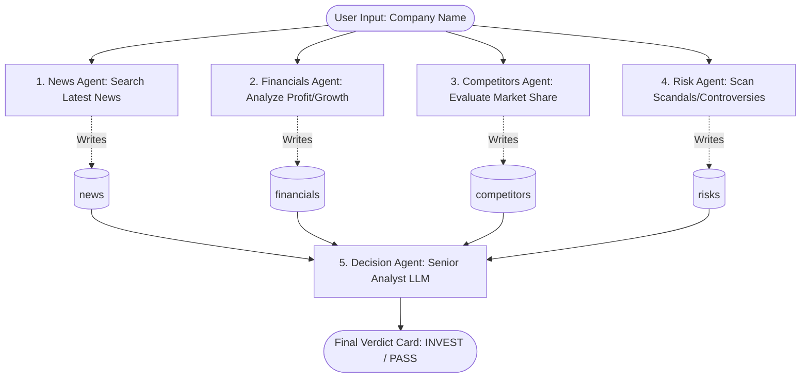

# AI Investment Research Agent

An advanced, multi-agent AI Investment Research Agent built as a project for **InsideIIM / Altuni AI Labs**. 

This agent uses a state-of-the-art multi-agent pipeline orchestrated with **LangGraph.js** and powered by **Google Gemini 2.5 Flash** and **Tavily Web Search**. It allows users to type in any company name, research it across multiple categories (news, financials, competitors, risks) in parallel, and get a structured investment verdict (**INVEST** or **PASS**) with confidence scoring, bull/bear cases, and citations.

---

## 🚀 Live Demo & Deployment
- **GitHub Repository**: [https://github.com/Ayush00029/INSIDE-IIM](https://github.com/Ayush00029/INSIDE-IIM)
- **Public ZIP Download Link**: [Download Project ZIP Folder](https://github.com/Ayush00029/INSIDE-IIM/archive/refs/heads/main.zip) (Automatically updated with every push)
- **Vercel Deployment URL**: [https://inside-iim.vercel.app](https://inside-iim.vercel.app)

---

## 📋 Overview
The AI Investment Research Agent automates the rigorous research phase an investment analyst goes through when evaluating a stock. 
1. The user inputs a company name (e.g. "Zomato" or "Infosys").
2. The agent launches **four parallel research agents** to fetch news sentiment, financial health, competitor standings, and key risk profiles from the web.
3. A **Decision Agent** (Senior Analyst LLM) synthesizes these raw inputs, performs a trade-off analysis, and returns a structured JSON recommendation.
4. The results are **streamed live** to a high-fidelity glassmorphic web interface.

---

## ⚙️ Local Setup & Installation

### 1. Clone the Repository
```bash
git clone https://github.com/Ayush00029/INSIDE-IIM.git
cd INSIDE-IIM
```

### 2. Install Dependencies
Dependencies are configured to resolve legacy peer dependency conflicts automatically using our custom `.npmrc` configuration:
```bash
npm install
```

### 3. Setup Environment Variables
Create a `.env.local` file in the root directory:
```env
# Google AI Studio Gemini API Key
GOOGLE_API_KEY=your_gemini_api_key_here

# Tavily Search API Key
TAVILY_API_KEY=your_tavily_api_key_here
```
> [!WARNING]
> **CRITICAL**: Never commit `.env.local` to GitHub. The project's `.gitignore` is pre-configured to ignore it.

### 4. Run the Development Server
```bash
npm run dev
```
Open [http://localhost:3000](http://localhost:3000) in your browser to interact with the UI.

---

## 🛠️ How It Works (Approach & Architecture)

The system is built on a concurrent fan-out / fan-in multi-agent system. Instead of sequential crawling (which is slow), we dispatch all four search agents concurrently.



1. **State Annotation:** A shared State memory containing fields for `company`, `news`, `financials`, `competitors`, `risks`, and `verdict`.
2. **Parallel Research:** The four research nodes execute concurrently using Tavily's web search API.
3. **Synthesis & Validation:** The `decisionAgent` receives all research parameters, invokes Gemini 2.5 Flash, and enforces a strict structural schema using **Zod** and Gemini's `withStructuredOutput` functionality.
4. **SSE Streaming:** Node completion chunks are piped through a Server-Sent Events stream from the Next.js API route directly to the browser UI.

---

## 🧠 Key Decisions & Trade-Offs

### 1. Parallel Node Execution vs. Sequential execution
* **Decision:** We migrated the LangGraph edges from sequential to parallel execution. 
* **Trade-off:** Running the searches in parallel reduces the overall web-crawling latency from **~15 seconds to ~4 seconds** (a **~4x speedup**). The trade-off is higher concurrent network load, which is easily handled by Tavily's standard API rate limits.

### 2. Node Factory Pattern vs. Hardcoded Node Functions
* **Decision:** Replaced the repetitive news/financials/competitors/risks node declarations with a `createResearchNode(field, querySuffix)` factory function.
* **Trade-off:** This reduced code bloat in `lib/agent.js` by over 50 lines and makes adding new agents (e.g. ESG Agent) trivial.

### 3. Built-in Retries vs. Custom Backoff Loop
* **Decision:** Utilized LangChain's built-in `maxRetries: 3` parameter inside `ChatGoogleGenerativeAI`.
* **Trade-off:** Removed over 20 lines of manually-managed `for` loop with exponential backoff timers, leveraging the SDK's well-tested internal retry mechanism for transient rate limits (429 errors).

### 4. Custom `.npmrc` vs. Setting Manual NPM Flags
* **Decision:** Added `legacy-peer-deps=true` inside a local `.npmrc` file.
* **Trade-off:** Solves Vercel's strict `npm install` peer dependency checking on build without requiring developers to manually type `npm install --legacy-peer-deps`.

---

## 📊 Example Investment Verdicts

Three production test runs are saved under the `/examples` directory:

1. **Zomato (Verdict: INVEST, Confidence: 80%)**
   - *Key Strengths*: FY24 profit turnaround, 64% YoY revenue growth, Blinkit dominance in Quick Commerce.
   - *Key Risks*: Net profit pressure due to expansion, high competition in food delivery.
   - *Read full data:* [zomato.json](file:///examples/zomato.json)
2. **Infosys (Verdict: INVEST, Confidence: 75%)**
   - *Key Strengths*: Brand equity in IT, strong cloud & generative AI pipeline (Cobalt & Topaz).
   - *Key Risks*: Macro slowdown in US/Europe client budgets, talent retention costs.
   - *Read full data:* [infosys.json](file:///examples/infosys.json)
3. **Reliance Industries (Verdict: INVEST, Confidence: 85%)**
   - *Key Strengths*: Dual dominance of Jio (Telecom) & Retail, heavy pivot to Green Hydrogen.
   - *Key Risks*: Cyclicality of oil-to-chemicals refinery margins.
   - *Read full data:* [reliance.json](file:///examples/reliance.json)

---

## 📈 Future Improvements (With More Time)
1. **Interactive Chat Mode:** Allow the user to ask follow-up questions about the verdict card (e.g. "Explain why you have low confidence on the financials").
2. **PDF Parsing Support:** Integrate filing readers to let the agent parse uploaded PDF quarterly reports directly instead of web searches.
3. **Search Caching:** Implement Redis caching for search queries to save Tavily token consumption for duplicate lookups.
4. **Customizable Guardrails:** Allow users to set their own investment criteria weights (e.g., higher weight on risks or green energy).

---

## 🎁 BONUS: Pair Programming Chat Log/Transcript
For full transparency into the development process, the complete transcript of the developer's chat sessions with the AI Coding Assistant (representing our full thought process, debugging steps, and planning) has been compiled and is publicly accessible:
- **Chat Transcript Markdown Document**: [chat_session_transcript.md](file:///c:/Users/hi/Desktop/inside-iim/chat_session_transcript.md)
